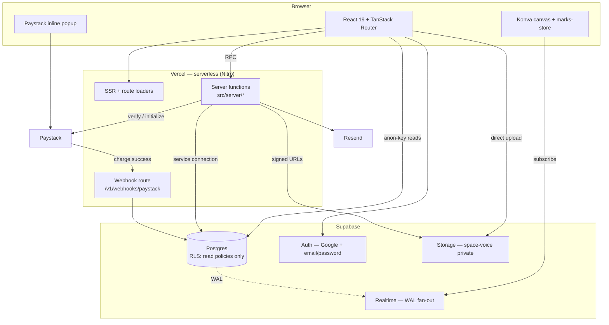
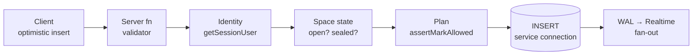
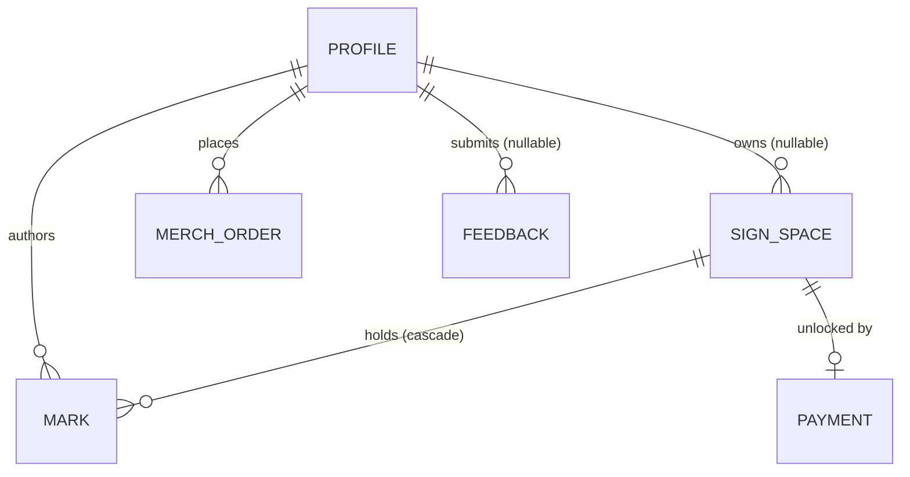
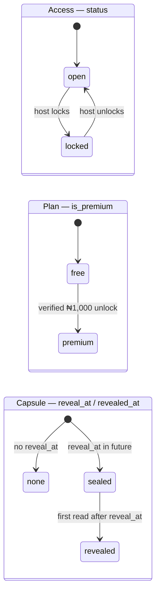
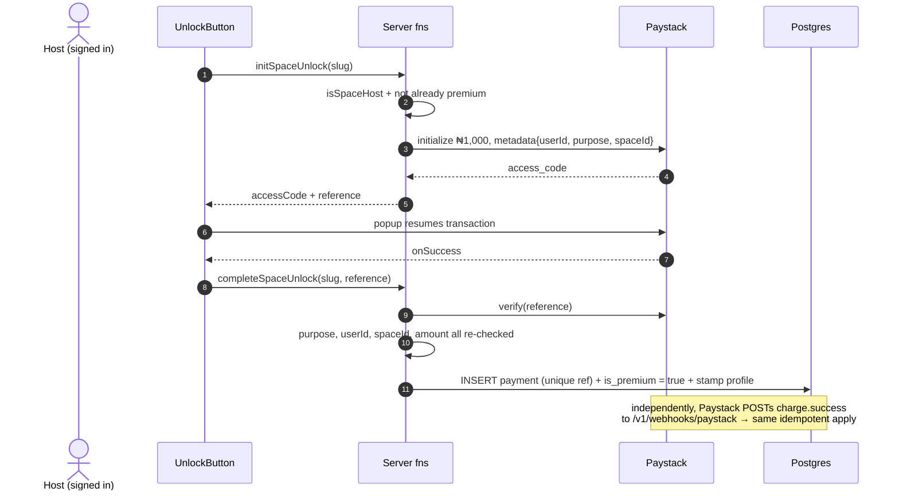
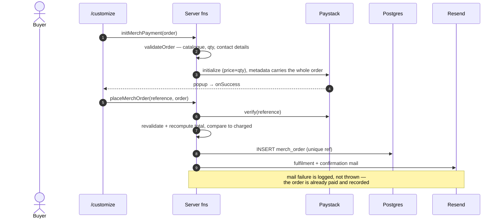

# Sign Me Out — System Architecture

## 0 · What this document is

Sign Me Out is a shareable infinite canvas for the Nigerian sign-out tradition. A host opens a
board, shares one link, and coursemates leave signatures, doodles, well-wishes and voice notes on
it. The board can be exported as an image or PDF, or printed onto merchandise.

This document covers the domain model, the data model, and how the running system is structured.
It is for people **changing** the system. It is not a user guide and not an API reference.

> **Supersedes [`architecture.md`](./architecture.md)** (commit `a05c380`, July 2026). That
> document describes a *pay-to-create* model — ₦1,000 before a board exists — which is no longer
> how the system works. Its sequence diagrams for identity, signing and mark permissions remain
> broadly accurate; its payment and space-creation flows do not. Kept for the reasoning trail.

**The two decisions everything else follows from:**

1. **There is no application server process and no scheduler.** The app deploys to Vercel as
   serverless functions (TanStack Start on Nitro). Nothing is long-running, so anything that
   "happens on a schedule" must instead be triggered by a request that was going to happen
   anyway, or by an inbound webhook. §6 is entirely shaped by this.
2. **RLS is read-only-by-policy: the browser can read some tables directly and write to none.**
   `scripts/init-policies.sql` grants `anon`/`authenticated` SELECT on `sign_spaces`, `profiles`,
   and *visible* `marks`, and grants no INSERT/UPDATE/DELETE anywhere. So every write goes through
   a server function on the service connection (§5), while reads have two legitimate paths — the
   server function *and* the browser's own Supabase client. That second path is not incidental:
   it is what makes Realtime work (§7.1), and it is the reason a server-side visibility rule is
   not automatically a security boundary — the capsule seal has to live in the policy itself (§5).

A third, smaller decision worth stating early because it surprises people: **payment rows are
written only after money has landed** (§7.4). A cancelled checkout leaves no trace anywhere.

---

## 1 · Topology



**Why not fewer components.** The honest answer for most of them is that they are managed
services standing in for code we would otherwise write, and each holds something the app cannot:

| Component | What it holds that nothing cheaper does |
|---|---|
| Postgres | the durable state, and the uniqueness constraints that make payments idempotent |
| Supabase Auth | identity, and the JWT the server validates per request |
| Realtime | WAL fan-out to every viewer — the alternative is polling every open board |
| Storage (private bucket) | voice recordings that must not be publicly addressable |
| Paystack | the card rails and the secret that authenticates the webhook |
| Resend | outbound mail with idempotency keys |

**Why the webhook is its own route rather than a server function.** Server functions are called
over TanStack's RPC protocol by our own client. Paystack posts a raw signed body to a plain HTTP
endpoint and authenticates with an HMAC over the exact bytes — a different caller, a different
authentication mechanism, and no session. It is the one inbound path not initiated by our UI, so
it gets its own boundary.

**What is deliberately *not* a component:** no queue, no worker, no cron. See §6.

### 1.1 · Layers

One `addMark` request, end to end, naming every point it can be rejected:



| Layer | Decides | How it fails |
|---|---|---|
| Client store | optimistic placement, id generation | not a gate — never trusted |
| `.validator()` | shape, kind whitelist, field caps | throws before the handler runs |
| Identity | is there a signed-in signer? | throws "Sign in to…" |
| Space state | is the board `open`? | throws — locked boards reject writes |
| Plan | free-tier caps, voice gating | throws the user-facing upsell message |
| Postgres | uniqueness, FKs, NOT NULL | constraint violation, surfaces as 500 |
| RLS | nothing on the write path — no write policies exist | denies by default; see §5 for the read path |

The client store is a *layer*, not a gate. Every rule it appears to enforce is re-enforced server
side; UI gating exists to avoid pointless round-trips, never to protect an invariant.

---

## 2 · Domain model



**Sign space** — one board. Has a public `slug`, a host, and a `university` (free text, required
at creation, so per-university counts survive edits to the picker list). Optionally carries a
*gift bank account* and a *time-capsule reveal time*.

**Mark** — one object on a canvas. A single entity covers all four kinds (`stroke`, `text`,
`photo`, `voice`); see §3 for why they aren't separate types. Every mark has a world transform
(x, y, rotation, scale, z) so anything can be moved.

**Payment** — a Paystack transaction that unlocked one space. **Merch order** — a paid
merchandise purchase, fulfilled by email. **Profile** — a signer, mirrored from `auth.users` by a
trigger. **Feedback** — free-text, optionally anonymous, referencing nothing.

### Invariants

| # | Invariant | Enforced where |
|---|---|---|
| I1 | Only the host may lock, recolour, delete, or set the gift on a space | `isSpaceHost` in each space server fn |
| I2 | Only the mark's author or the space host may move/remove/restore it | `assertCanEdit` (`marks.ts`) |
| I3 | A free board holds ≤5 visible marks total; ≤2 host, ≤1 per guest | `assertMarkAllowed` (`plan.ts`), called by `addMark` |
| I4 | Voice notes require a premium board | same |
| I5 | A payment reference is spent exactly once | `UNIQUE` on `payments.reference` / `merch_orders.reference` |
| I6 | An unlock costs exactly ₦1,000 | `applyVerifiedUnlock` re-checks against `UNLOCK_PRICE_KOBO` |
| I7 | A merch total equals catalogue price × qty | `applyVerifiedMerchOrder` recomputes and compares |
| I8 | Gift bank fields are all set or all null | `lib/gift.ts` validation on write |
| I9 | A sealed capsule's marks are unreadable by non-hosts | `getSpaceBySlug` returns `marks: []`, **and** the `marks_select` RLS policy checks `reveal_at` (§5) |
| I10 | The reveal email blast is sent at most once per space | atomic `UPDATE … WHERE revealed_at IS NULL` |

**I3, I4 and I8 are application-enforced only.** Nothing in the schema prevents a sixth mark on a
free board. This is a deliberate trade — the rules changed twice during pricing experiments, and
they read better as one tested pure function (`plan.ts`, with `plan.test.ts`) than as a trigger.
The exposure is bounded because there is exactly one write path (§0.2). If a second writer ever
appears, these become triggers.

---

## 3 · Data model

Six tables — `sign_spaces`, `marks`, `payments`, `merch_orders`, `feedback`, `profiles`. Schema
lives in `src/db/schema.ts`; generated DDL in `drizzle/`. Column-level detail is not repeated
here — it drifts.

### Structural decisions

**One `marks` table for four kinds, not four tables.** The condition that decided it: all four
share the same permission model (I2), the same lifecycle (`visible`/`hidden`), the same world
transform, and the same realtime subscription. The kind-specific columns are nullable and
unenforced. *If* a kind ever needs its own permissions or lifecycle, that condition breaks and
the table should split.

**`payments` is separate from `merch_orders`,** despite both being Paystack charges. They differ
in what they reference (a space vs. nothing), what they do on success (flip a flag vs. record a
fulfilment record), and their retention needs. Note the consequence: their `reference` uniqueness
is enforced *per table*, so a reference spent in one is not spent in the other. `purpose` in the
transaction metadata is what actually keeps them apart, and both record paths check it.

**`university` is free text, not a foreign key.** Per-university counts must survive edits to the
picker list; a FK would rewrite history when an entry is renamed.

**Gift details are snapshotted onto the space,** not referenced. A gift account is a value the
host typed, not an entity with a lifecycle.

### Entity lifecycles

A sign space carries **three orthogonal lifecycles**. They are independent — a board can be
locked *and* premium *and* sealed — which is why they are three columns and not one status enum.



`premium → free` and `revealed → sealed` have no transition: unlocks are not refundable in the
system, and a revealed board cannot be re-sealed. Both are terminal by design.

| Entity | States | Transitions |
|---|---|---|
| Mark | `visible` → `hidden` → `visible` | soft delete, so removal is undoable |
| Payment | `success` only | see below |
| Merch order | `paid` only | see below |

**Both status columns are pinned to their only reachable value.** Because no row is written
until the charge has succeeded (§7.4), `'success'` and `'paid'` are the only values the code ever
writes. The defaults used to say `'pending'` and the comments advertised `'failed'`, which
described a state machine that could not occur; migration `0011` corrects the defaults and adds
`payments_status_ck` / `merch_orders_status_ck` to hold the domain to reality.

The columns are kept rather than dropped because `deliverMerchOrderEmails` guards on
`status = 'paid'`, and because a refund or chargeback state is plausible later — widening the
CHECK is one migration, and is the intended path if that day comes.

---

## 4 · Identity

Two actor types, authenticated by different mechanisms. This is the most commonly misread part of
the system.

| Actor | Identified by | Scope | Survives |
|---|---|---|---|
| **Signer** | Supabase Auth JWT (Google or email/password) | all boards | any device, after sign-in |
| **Host** | signed `smo_host` httpOnly cookie **or** owning account | boards they created | the cookie: one browser, one year. the account: everywhere |

A host is deliberately **not** required to have an account. `ensureHostToken()` mints a UUID
cookie on first space creation, so someone can open a board and run it without signing up.
`sign_spaces.owner_id` is nullable for exactly this reason.

`isSpaceHost(space, user)` is the single source of truth and returns true if *either* the cookie
matches `host_token` *or* the signed-in account matches `owner_id`. Never compare `host_token`
inline — the dual condition is the whole point.

**Staleness:** the JWT is validated per request via `auth.getUser()`, so revocation is immediate.
The host cookie is not revocable — clearing it loses cookie-only host access to a board with no
`owner_id`, permanently. That is the accepted cost of accountless hosting.

**Signing requires an account even though hosting doesn't.** Marks are attributed, and the reveal
blast (§6) emails signers — both need a real identity.

---

## 5 · Authorization

Four stages, in order. Each fails loudly except where noted.

1. **Authentication** — `getSessionUser()`. Fails with a "Sign in to…" error the UI turns into
   the sign-in dialog.
2. **Host check** — `isSpaceHost()`. Guards lock, delete, recolour, gift, and unlock. Throws
   "Only the host can…".
3. **Ownership check** — `assertCanEdit()` for marks: author *or* host. Throws.
4. **Plan check** — `assertMarkAllowed()`. Throws a message written to be shown to the user
   verbatim, because it doubles as the upsell.

**RLS is a fifth stage, and it governs reads rather than writes.** Every table has
`.enableRLS()`. The policies in `scripts/init-policies.sql` are all `for select`:

| Table | Policy | Effect |
|---|---|---|
| `sign_spaces` | `to anon, authenticated using (true)` | any board readable by anyone holding the anon key |
| `marks` | `status = 'visible'` **and** the space is open, revealed, or owned by the caller | visible marks readable, except on a capsule that hasn't opened; hidden ones never leave the DB |
| `profiles` | `to anon, authenticated using (true)` | signer names/avatars readable |
| `payments`, `merch_orders`, `feedback` | *(none)* | invisible to the browser entirely |

There are **no write policies on any table**, so the browser cannot INSERT, UPDATE or DELETE —
writes are structurally confined to the service connection, which bypasses RLS.

**RLS fails silently**: a policy-denied read returns zero rows, not an error. That is fine for the
write path (which never relies on it) but is the trap to remember when adding any browser query.

The consequence worth internalising: **a rule enforced only in a server function is not a
security boundary for reads**, because the browser has a second, legitimate read path. The
capsule seal was originally exactly that mistake — withheld by `getSpaceBySlug` but readable
straight from PostgREST — which is why `marks_select` now carries the `reveal_at` check itself.

The one asymmetry it leaves: a **cookie-only host** (`owner_id IS NULL`) can't be identified by a
policy, so they load their sealed board's marks through the server fn but receive no Realtime
updates until it opens. Signed-in hosts match `owner_id = (select auth.uid())` and stream
normally.

**Voice playback is authorized separately.** The bucket is private; `getVoiceUrl` re-runs the
author-or-host check and mints a 5-minute signed URL. The URL itself is a bearer token for those
5 minutes — anyone it is forwarded to can play the recording.

---

## 6 · Automation

Everything that happens without a user asking. There is no cron, no queue and no worker (§0.1),
so there are only two mechanisms:

**1 · Read-triggered work.** A time capsule opens because someone *loads the page*, not because a
job fired. `getSpaceBySlug` compares `reveal_at` to now on every read. The one thing that must
happen exactly once — the "your board is open" email blast — is claimed atomically:

```sql
UPDATE sign_spaces SET revealed_at = now()
 WHERE id = $1 AND revealed_at IS NULL AND reveal_at <= now()
```

Only the request whose `UPDATE` returns a row sends mail; concurrent readers see zero rows and
skip. The blast is best-effort and never throws — a mail failure must not break loading a board.

*The trade this makes:* a capsule nobody visits is never announced. The reveal is lazy, and the
email arrives when the first person shows up, not at midnight. Accepted, because the alternative
is a scheduler this deployment target does not have.

**2 · Inbound webhooks.** Paystack posts `charge.success` to `/v1/webhooks/paystack`. This is the
*durable* half of payment recording (§7.4) — the browser callback is the fast half, and either
may arrive first.

**A database trigger** mirrors `auth.users` into `profiles` on signup (see
`scripts/init-policies.sql`). It is the only logic living in the database.

---

## 7 · Capabilities

### 7.1 · Realtime

Marks fan out over Supabase Realtime, filtered `space_id=eq.<id>`. Realtime enforces RLS as the
subscribing client, so the `marks_select` policy (§5) is load-bearing: without it no client would
receive anything, and because it is scoped to `status = 'visible'`, soft-deleted marks are never
broadcast. Two further decisions make it work:

- **Mark ids are generated client-side.** When Realtime echoes your own INSERT back, the store
  upserts by id and the echo is a no-op. Without this, every mark would appear twice.
- **UPDATE echoes are merged as patches, never as replacements.** Postgres omits unchanged TOASTed
  columns from the WAL, so a move on a long stroke arrives with `points` missing. Treating it as a
  full row would erase the drawing.

### 7.2 · Storage

`space-voice` is **private**; reads go through 60-second signed URLs (§5). Uploads go direct
from the browser, permitted by `for insert to authenticated` policies on `storage.objects` — the
one place a client writes to Supabase without a server function, chosen so large recordings don't
round-trip through a serverless function. `space-media` exists for photos, which are currently
disabled in the UI. Deleting a space purges its media first,
best-effort — the purge never blocks the delete, because an unreachable bucket must not strand a
board the host asked to remove.

### 7.3 · Email (Resend)

Three kinds: merch fulfilment + buyer confirmation, the reveal blast, and feedback. All sends
carry idempotency keys derived from the reference, so a retry cannot duplicate mail.

**Failure semantics differ by path, deliberately:**

| Path | On inbox-send failure | Why |
|---|---|---|
| Unpaid `/customize` order | **throws** — the call fails | the email *is* the order of record; nothing was persisted |
| Paid merch order | logs, returns `inboxDelivered: false` | the DB row is the record of truth; telling a charged buyer their order failed would send them to pay twice |
| Reveal blast | logs, swallows | must not break page load |

### 7.4 · Payments (Paystack)

The load-bearing property: **nothing is written until money has landed**, and *two independent
paths* can do the writing.

- **Amounts are always derived server-side** from `plan.ts` / the catalogue, never accepted from
  the client, and re-checked against what Paystack reports before any row is written.
- **Merchandise orders are attached to the transaction metadata at initialize.** This is what
  makes the webhook self-sufficient: the delivery address exists nowhere else until the order is
  recorded, so without it a lost browser callback would leave an unfulfillable paid order.
- **Both paths converge on the same `applyVerified*` functions**, which are idempotent
  (`onConflictDoNothing` against a unique reference). Whichever arrives first wins; the second is
  a no-op.

### 7.5 · Canvas export

Export runs **entirely in the browser** (Konva → `jsPDF`), and is watermarked with the NexaHub
mark. No server round-trip, so no server-side rendering of user content and no export queue. The
live board is never watermarked — only the exported artifact.

---

## 8 · Flows

The two where the sequence is non-obvious. Identity, signing and mark permissions are unchanged
from [`architecture.md`](./architecture.md) §2, §5 and §6.

### 8.1 · Unlocking a board



### 8.2 · Paid merchandise order



---

## 9 · What was cut, and why

| Option | Why rejected | What would change it |
|---|---|---|
| Cron/scheduled job to open capsules | No scheduler on this deploy target; read-triggered reveal covers every case where anyone actually looks | Moving to a host with a scheduler, *or* capsules needing to notify with no reader present |
| Writing a `pending` payment row at checkout | Abandoned checkouts would accumulate rows needing reconciliation; deferred insert keeps the tables clean | Needing analytics on abandonment, or a provider without a metadata field |
| Storing merch details in a `pending` row instead of Paystack metadata | Same as above; metadata makes the webhook self-sufficient without a reconciliation sweep | Orders growing past the metadata size limit |
| Enforcing free-tier caps in a DB trigger | The rules changed twice during pricing work; a tested pure function is cheaper to change and easier to unit-test | A second write path appearing (see §2, I3) |
| Splitting `marks` into per-kind tables | All four kinds share permissions, lifecycle, transform and subscription | Any kind needing its own permission model or lifecycle |
| Requiring an account to host | Hosts need to open a board in seconds, at a moment when they are least patient | Hosting gaining cross-device requirements that a cookie can't meet |
| Server-side export rendering | Would need a headless browser and a queue; the canvas already exists in the client | Exports needing to be generated without a viewer present |

---

## 10 · Known gaps

Honest list, current as of this document. The five defects this section originally recorded have
been closed; what remains are the residual trade-offs those fixes left behind.

1. **A cookie-only host gets no live updates on a sealed capsule.** RLS cannot identify a host who
   has no account (§5), so `marks_select` can't make an exception for them. They see every mark on
   page load and must refresh to see new ones until the capsule opens. Signing in fixes it, which
   is the nudge we want anyway.
2. **A signed voice URL is still a bearer token**, now for 60 seconds rather than five minutes
   (§7.2). Inherent to signed URLs — the lever is exposure time, not elimination. Forwarding one
   inside that window shares the recording.
3. **Reconciliation is manual.** `npm run reconcile` finds charges that both recording paths lost
   and `--replay` records them, but nothing runs it on a schedule — there is no scheduler (§0.1).
   Running it weekly is an operational habit, not an enforced one.
4. **The capsule reveal is still lazy** (§6). A capsule nobody visits is never announced. This is
   a deliberate consequence of having no scheduler, not an oversight.

---

*Written against the code at `main` (August 2026): server functions in `src/server/`, schema in
`src/db/schema.ts`, canvas client in `src/features/canvas/`.*
