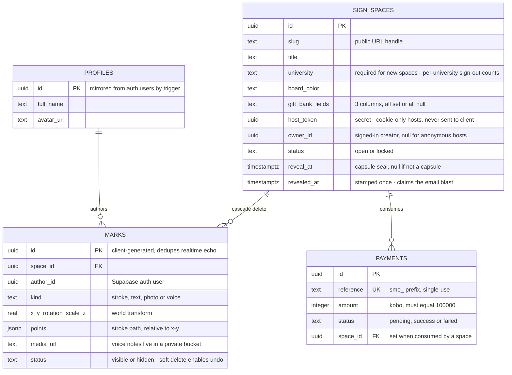
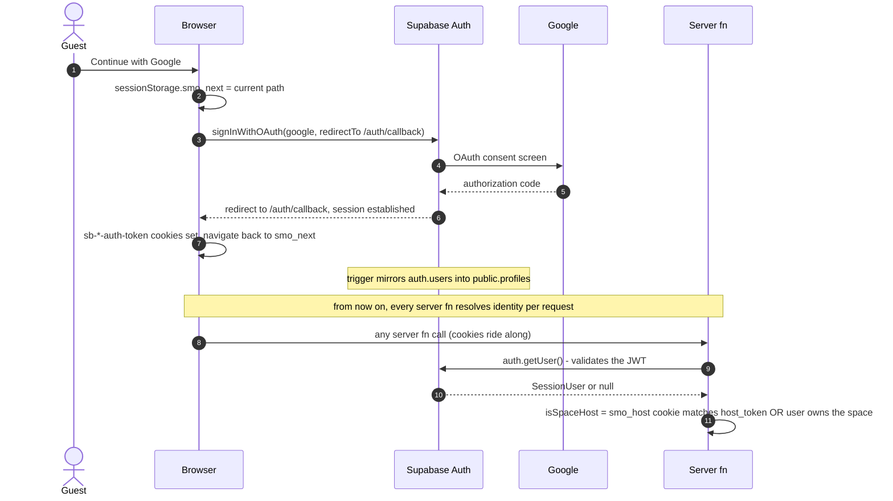
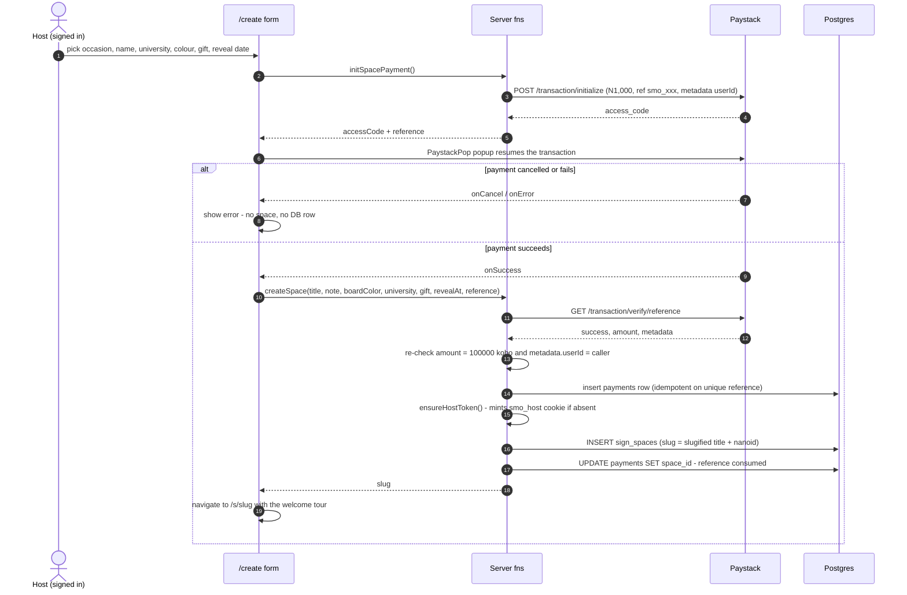
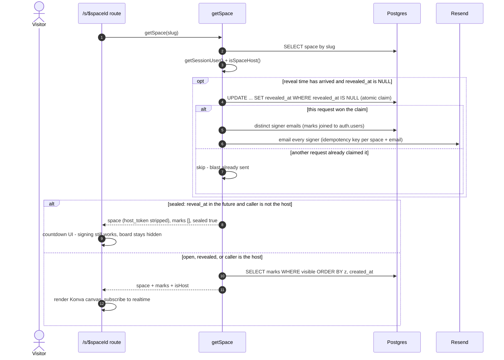
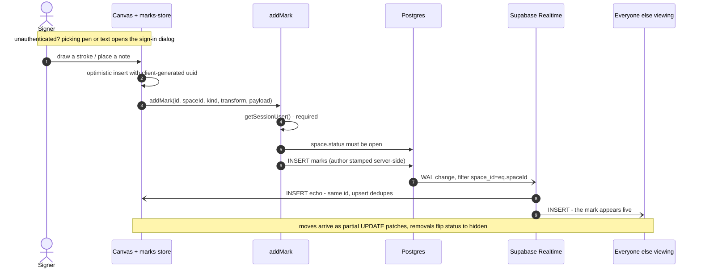
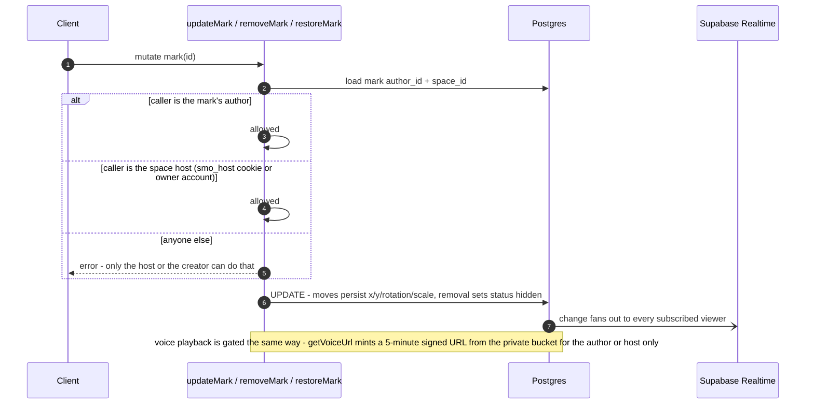

# Sign Me Out — architecture sequence diagrams

Sign Me Out is a paid, shareable infinite canvas: a host opens a board for ₦1,000, friends
sign it with strokes, notes, photos and voice messages, and everything syncs live. These
diagrams trace the six structures that hold the app together, each drawn from the actual
server functions and client stores.

- [1 · The data model](#1--the-data-model)
- [2 · Identity: signers and hosts are different things](#2--identity-signers-and-hosts-are-different-things)
- [3 · Opening a space: pay first, insert after](#3--opening-a-space-pay-first-insert-after)
- [4 · Loading a board, and how a time capsule opens itself](#4--loading-a-board-and-how-a-time-capsule-opens-itself)
- [5 · Signing the board: optimistic writes, live fan-out](#5--signing-the-board-optimistic-writes-live-fan-out)
- [6 · Who may change what](#6--who-may-change-what)

## 1 · The data model

> `src/db/schema.ts`

Six tables, all behind RLS with **no client policies** — every write goes through a
TanStack Start server function using the service connection. `sign_spaces` is the hub;
`marks` is a single table covering all four kinds of canvas object; `payments` holds paid
rows only (a checkout that never completes leaves no trace).

Also: `merch_orders` (Paystack-paid merchandise, fulfilment by email) and `feedback`
(the floating pill, anonymous allowed) hang off the same server-only pattern but
reference nothing.

## 2 · Identity: signers and hosts are different things

> `src/features/auth/actions.ts` · `src/server/auth.ts`

Signers authenticate with Google through Supabase. Hosts are identified by a separate
**signed `smo_host` cookie**, minted when they create their first space — so a host works
across spaces even before signing in, and an owner works across devices after.

## 3 · Opening a space: pay first, insert after

> `src/routes/_app/create.tsx` · `src/server/payments-core.ts` · `src/server/spaces.ts`

The DB write is **deferred until Paystack confirms the money landed**: no row exists for a
cancelled checkout, and the payment reference is single-use — creating the space stamps it
with the `space_id` it bought.

## 4 · Loading a board, and how a time capsule opens itself

> `src/server/spaces.ts` (`getSpace`) · `src/server/reveal-core.ts`

There is **no scheduled job**. A capsule opens because reads compare `reveal_at` to now;
the only thing that must happen exactly once — the "it's open!" email blast — is claimed
atomically by the first read that flips `revealed_at` from `NULL`.

## 5 · Signing the board: optimistic writes, live fan-out

> `src/server/marks.ts` (`addMark`) · `src/features/canvas/use-realtime-marks.ts` · `marks-store.ts`

Mark ids are **generated client-side**, so when Supabase Realtime echoes your own INSERT
back, the store's upsert dedupes it silently. UPDATE echoes can be partial — Postgres omits
unchanged TOASTed columns like a long stroke's `points` — so they merge as patches, never
as full replacements.

## 6 · Who may change what

> `src/server/marks.ts` (`assertCanEdit`) · `src/server/spaces.ts`

`assertCanEdit` is the single server-side gate for mutating a mark: the author or the host,
nobody else — UI gating is never trusted. Host-only space actions (lock, recolour, gift,
delete) run the same `isSpaceHost` check; deleting a space drops its payment rows **inside
the same transaction** so the single-use reference can't be recycled into a free space.

---

*Drawn from the code at commit `a05c380` — server functions in `src/server/`, canvas
client in `src/features/canvas/` (July 2026).*
